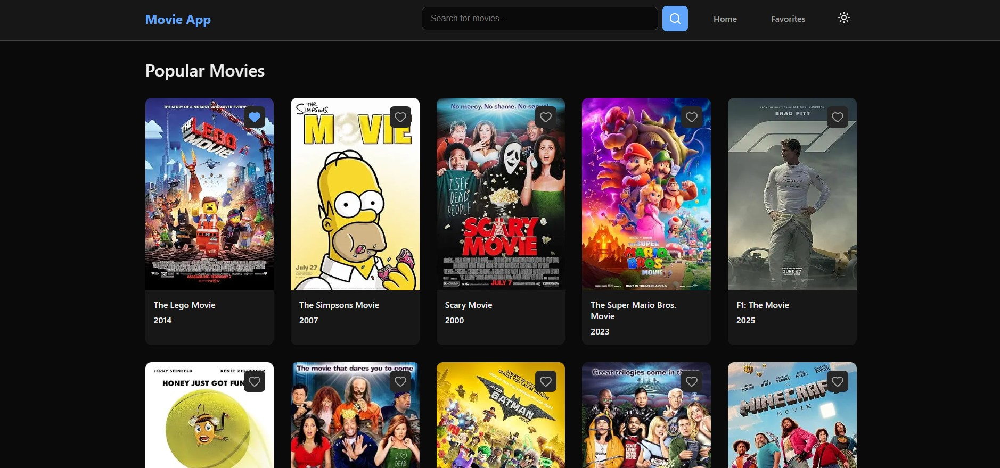
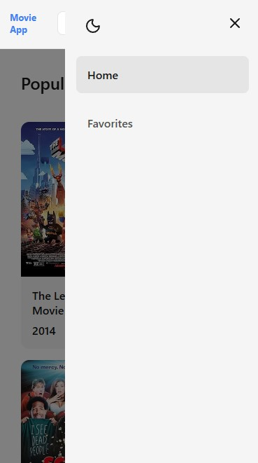

# Movie App

Welcome to the **Movie App**, a modern web application that allows you to explore movies from the OMDb API database. Search for any movie, view detailed information, add favorites, and enjoy a seamless experience with dark/light mode support.

## 🚀 Features

- **Search Movies** - Search any movie using the OMDb API with real-time results
- **Movie Details** - Dynamic routing for each movie with comprehensive information (synopsis, genre, director, cast, ratings)
- **Favorites Management** - Add or remove movies from your favorites list, persisted in localStorage
- **Dark/Light Mode** - Seamless theme switching with persistent preferences
- **Responsive Design** - Fully responsive with mobile-friendly burger menu navigation
- **Server-Side Rendering** - Optimized performance with Next.js SSR and React Server Components
- **Custom Fetch Wrapper** - Universal API wrapper that works on both server and client
- **Image Optimization** - Automatic image optimization using Next.js Image component
- **Error Handling** - Graceful error handling with loading states and user-friendly messages
- **TypeScript** - Full type safety throughout the application
- **SCSS Modules** - Modular and maintainable styling

## 🛠️ Tech Stack

- **Next.js 16** - React framework with App Router
- **TypeScript** - Type-safe development
- **SCSS Modules** - Component-scoped styling
- **Zustand** - Lightweight state management
- **OMDb API** - Movie data source
- **Bun** - Fast package manager and runtime
- **ESLint** - Code quality and linting

## 📸 Preview

### Light and Dark Mode Views with Responsive Design

Below are screenshots showcasing the Movie App interface in both light and dark modes, demonstrating responsive layout and theming:

<p align="center">
  
</p>
<p align="center">
  
</p>

## 📁 Project Structure

```
src/
├── app/                    # Next.js App Router pages
│   ├── page.tsx           # Home page (Server Component)
│   ├── search/            # Search results page
│   ├── movie/[id]/       # Movie details page (Dynamic route)
│   ├── favorites/         # Favorites page (Client Component)
│   ├── layout.tsx         # Root layout
│   ├── not-found.tsx      # 404 page
│   └── globals.scss      # Global styles
├── components/
│   ├── client/            # Client Components (use client)
│   │   ├── SearchBar.tsx
│   │   ├── ThemeToggle.tsx
│   │   ├── FavoriteButton.tsx
│   │   └── MobileMenu.tsx
│   └── server/            # Server Components
│       ├── Header.tsx
│       ├── MovieCard.tsx
│       ├── MovieGrid.tsx
│       ├── LoadingSpinner.tsx
│       └── ErrorMessage.tsx
├── lib/                   # Utility functions
│   ├── api.ts            # Custom fetch wrapper & API functions
│   └── utils.ts          # Helper functions
├── states/                # State management
│   ├── favoritesStore.ts # Favorites Zustand store
│   ├── themeStore.ts     # Theme Zustand store
│   └── mobileMenuStore.ts # Mobile menu Zustand store
└── types/                # TypeScript types
    └── movie.ts          # Movie-related types
```

## ⚙️ Prerequisites

Before getting started, make sure you have:

1. **Bun** - Install from [bun.sh](https://bun.sh)

   ```bash
   curl -fsSL https://bun.sh/install | bash
   ```

2. **OMDb API Key** - Get a free API key from [omdbapi.com](https://www.omdbapi.com/apikey.aspx)

## 🖥️ How to Run Locally

1. **Clone the repository**

   ```bash
   git clone (https://github.com/aamirazaynn/movies-application)
   cd movies-application
   ```

2. **Install dependencies**

   ```bash
   bun install
   ```

3. **Set up environment variables**
   Create `.env.local` file and add:

   ```
   NEXT_PUBLIC_OMDB_API_KEY=your_api_key_here
   ```

4. **Run the development server**

   ```bash
   bun run dev
   ```

5. **Open your browser**
   Navigate to [http://localhost:3000](http://localhost:3000)

## 🏗️ Design Decisions & Challenges

### Server vs Client Components

The application strategically separates Server and Client Components following Next.js best practices:

- **Server Components** (default): Used for data fetching, static content, and SEO optimization. Examples: `Header`, `MovieCard`, `MovieGrid`, all page components.
- **Client Components**: Used only for interactivity requiring browser APIs. Examples: `SearchBar`, `ThemeToggle`, `FavoriteButton`, `MobileMenu`.

This approach minimizes JavaScript bundle size, improves performance, and leverages Next.js SSR capabilities.

### Mobile Menu Scroll Challenge

**Problem**: The mobile menu caused body scroll issues when opened, creating a poor user experience.

**Solution**: Implemented React's `createPortal` with proper mounting checks:

- Renders menu directly to `document.body` using `createPortal`
- Uses `mounted` state to prevent hydration mismatches (SSR compatibility)
- Manages body scroll lock when menu is open/closed
- Ensures proper cleanup on component unmount

This solution eliminates scroll interference and maintains SSR/hydration compatibility.

### State Management

- **Zustand**: Lightweight state management for favorites and theme
- **localStorage Persistence**: Zustand's persist middleware handles data persistence
- **Hydration Safety**: Client components check `mounted` state before accessing browser APIs

### Custom API Wrapper

The custom fetch wrapper (`lib/api.ts`) provides:

- Universal compatibility (server and client environments)
- Automatic API key injection and validation
- Comprehensive error handling
- Next.js caching for optimal performance
- Full TypeScript type safety

## ✨ Implemented Features

### Core Requirements ✅

1. **Search Movies** - Search functionality with movie poster, title, release year, and rating display
2. **Movie Details Page** - Dynamic routing with comprehensive movie information
3. **Favorite Movies** - Add/remove favorites with localStorage persistence
4. **Responsive Design** - Fully responsive with SCSS modules
5. **State Management** - Zustand for favorites and theme
6. **Routing** - Next.js App Router (home, search, movie details, favorites)
7. **Error Handling** - Loading states, error messages, and graceful degradation
8. **Performance** - Image optimization, code-splitting, lazy loading, API caching
9. **Accessibility** - Semantic HTML, ARIA labels, keyboard navigation
10. **Code Quality** - TypeScript, ESLint, clean code structure
11. **Dev Tools** - Bun package manager, ESLint

### Bonus Features ✅

- **Server-Side Rendering (SSR)** - Strategic use of React Server Components
- **Animations & Transitions** - Smooth theme transitions, menu animations, hover effects

## 📝 Available Scripts

- `bun run dev` - Start development server
- `bun run build` - Build for production
- `bun run start` - Start production server
- `bun run lint` - Run ESLint

## 🚀 Deployment

The application is ready to deploy on Vercel:

1. Push your code to GitHub
2. Import the project in Vercel
3. Add your `NEXT_PUBLIC_OMDB_API_KEY` environment variable
4. Deploy!
